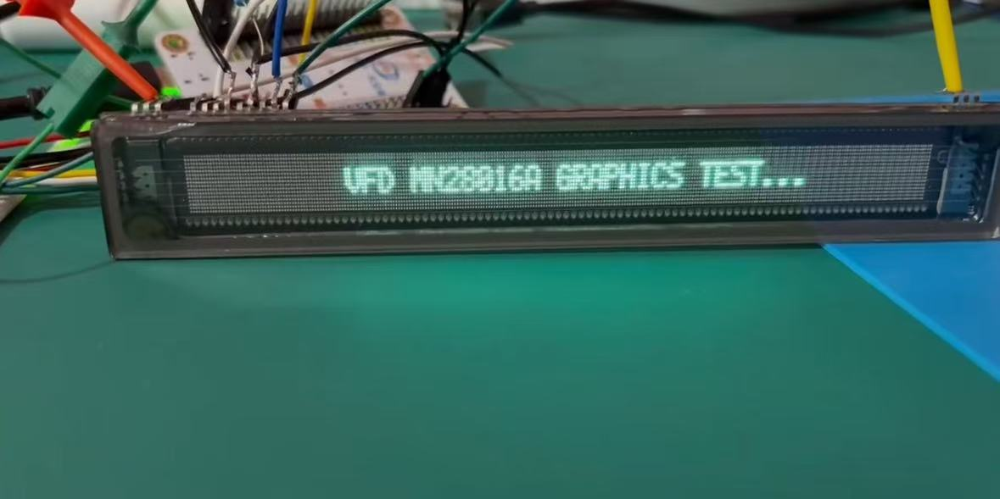

# MN28016A-ESP32
> VFD Display. 280x16 dot matrix screen using PlatfromIO Esp32 driver

This is a use of ESP32 PlatformIO framework to drive VFD display model: MN28016A
The code successfully realized the screen automatically and constantly refreshed, and drive the implementation of the drawing point function.
The code according to the draw point function successfully ported u8g2 framework can realize more complex graphical operations.

## Usage
- SPI protocol DMA method is used to continuously fetch data from the buffer for scrubbing
- The send_buffer function takes data from the screen bitmap buffer and converts it to VFD protocol data, modifying it into the DMA buffer
- When you use it, please modify the pin definitions and SPI channels in **lib\mn28016a\mn28016a.cpp** according to the pin differences.
